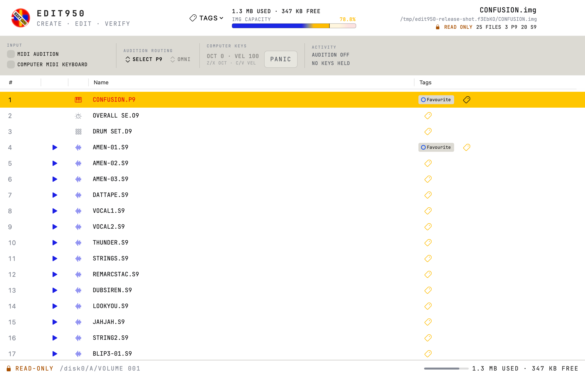
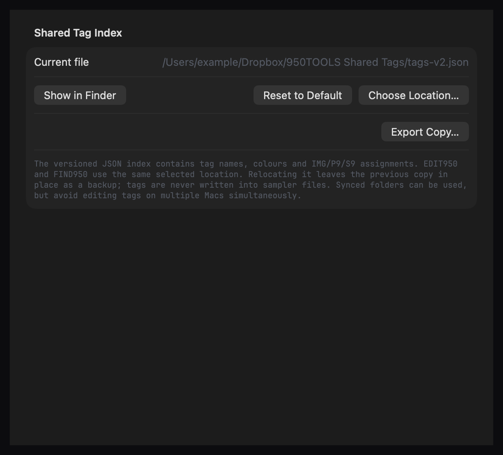
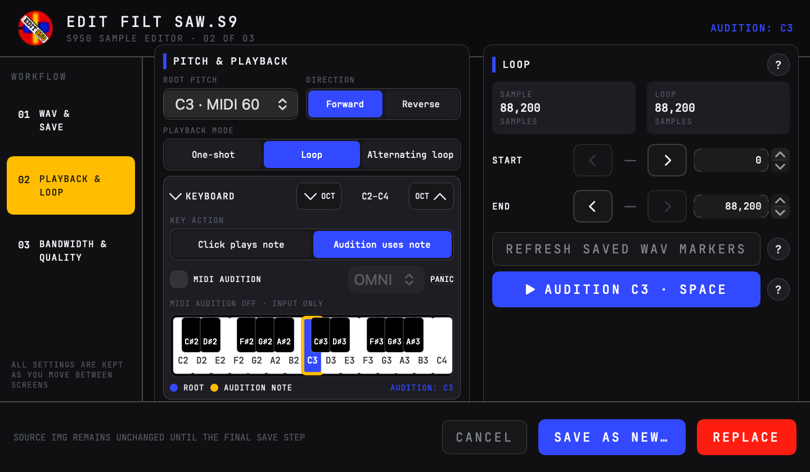
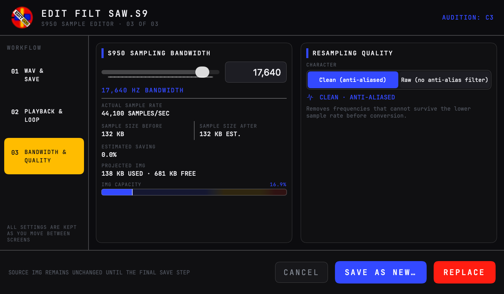
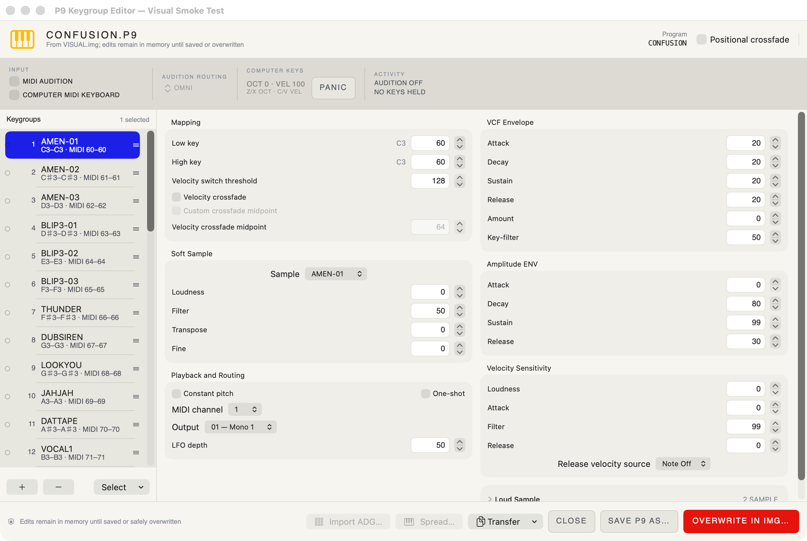
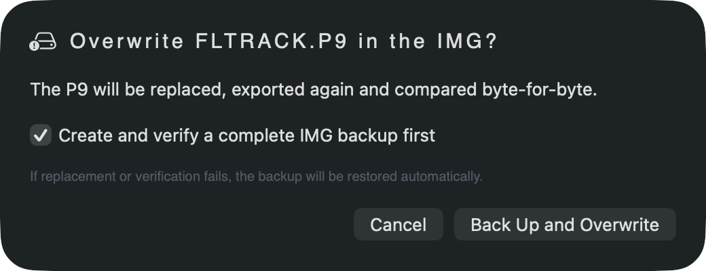
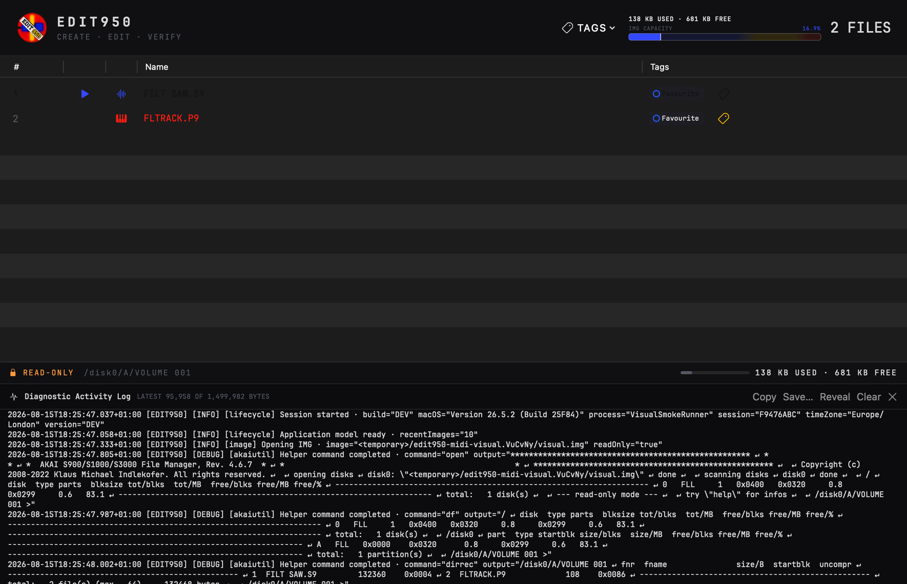

# EDIT950

<p align="center">
  
</p>

<p align="center"><strong>CREATE · EDIT · VERIFY</strong></p>

[](https://github.com/richiewarburton/EDIT950/actions/workflows/ci.yml)
[](LICENSING.md)

**User manual:** [Read the EDIT950 musician's guide](Documentation/USER_GUIDE.md).

## Open the S900/S950 disks you thought were stranded in the past

If your old sampler floppies now exist as `.img` files, EDIT950 makes
them useful on a modern Mac. Open an image and see the original volumes, P9
programs and S9 samples. Audition samples, export WAVs, inspect the program that
made a sound work, edit native parameters, or build a clean working image for a
Gotek, another archive or a DAW workflow.

This is for people who:

- rescued disks with a Greaseweazle or another imaging tool;
- have a folder copied from a Gotek or USB floppy emulator;
- inherited an S900/S950 library but no longer own the sampler;
- want the original programs and keygroups, not just disconnected WAV files; or
- still use the hardware and need a safer way to prepare IMG files.

You do **not** need an S900 or S950. EDIT950 works with disk-image files and never
formats or writes a physical drive.

Current source version: **1.8.47 (build 68)**. Requires macOS 14 or later.

### What is new in 1.8.47

- Audition a chosen P9 from the main IMG browser using external MIDI or the
  computer keyboard, independently of ordinary table selection, with visible
  note activity and a yellow spot on the triggered S9 row.
- Play every prepared S9 from its row icon or the Space bar, retain currently
  playing audio during bandwidth conversion, and recover the audition engine
  after an interruption.
- Associate IMG, P9 and S9 files from Settings, close an IMG explicitly, and
  see its filename, path, access mode and P9/S9 counts in the header.
- Use the reorganized audition header, direct GitHub user-manual link and manual
  GitHub release check. Companion-app handoffs now belong to the loaded IMG's
  inspector.
- Use one **Save P9 As…** action for a standalone or renamed in-IMG copy, and
  deliberately duplicate or overwrite an unchanged program with the existing
  verification safeguards.

> **Known issue:** bulk P9 edits are not reliable when more than one keygroup is
> selected. This affects every field and every way of making a multi-keygroup
> selection, not only Release or Select All. Edit one keygroup at a time in this
> release. Progress is tracked in
> [issue #6](https://github.com/richiewarburton/EDIT950/issues/6).

See [the complete 1.8.47 release notes](ReleaseDocs/RELEASE_NOTES_1.8.47.md)
for every fix and validation result.



*EDIT950 opens the native disk directory. The header keeps current IMG capacity
visible while S9 samples and P9 programs remain available for audition and editing.*

## How to use EDIT950

1. Install the latest packaged build from the
   [Releases page](https://github.com/richiewarburton/EDIT950/releases), when
   available, or build the current source with `./Scripts/build-release.sh`.
2. Copy **EDIT950.app** to `/Applications` and open it.
3. Drag an IMG onto the window or choose **Open Image**.
4. If the image has several volumes, choose the one you want from the volume
   control. The table then shows the sampler-visible directory in its original
   order.
5. Press the play button beside an S9 to hear it. Double-click or use the action
   button to inspect its waveform, loop, pitch and bandwidth, or export it as
   WAV.
6. Use the visible **Tags** column or **IMG Tags** menu to label an IMG, P9 or
   S9. The same colour-coded tags appear in FIND950 without being written into
   the sampler files.
7. Open a P9 to inspect its keygroups, Soft/Loud layers, tuning, envelopes,
   filters and output assignments. Save only when you intend to change the IMG.
8. Use **Export**, **Import**, **New Image** or the focused export sent by
   FIND950 when you want a working disk for a Gotek, hardware sampler or DAW.

For irreplaceable disks, work from a copy and leave **Open read-only** enabled
until you have confirmed that the image and volume decode correctly.

The packaged public release may trail the source version shown above; each
release page states the included application version and checksum. The app is
ad-hoc signed rather than Developer ID signed or notarized, so macOS may require
**Privacy & Security → Open Anyway** on first launch.

AKAI Util 4.6.7 is included with EDIT950. No separate download, path selection,
`chmod` command or other Terminal setup is required. The application and helper
are Universal Apple Silicon and Intel builds. EDIT950 launches the helper
locally for the underlying read/write IMG filesystem operations.

Safe Eject and removable-media metadata cleanup are handled separately by
native EDIT950 code; they do not use AKAI Util.

## Will it open my disk captures?

- Standard S900/S950 `.img` images are the main format.
- If Greaseweazle produced an IMG file, open that copy directly.
- Floppy IMG files must have the expected 800 KB or 1.6 MB layout.
- Raw flux captures, `.scp` and `.hfe` files are not opened directly. Preserve
  those archival masters and export or convert a compatible IMG copy first.
- EDIT950 also supports its documented ISO and compatible raw-image layouts.
- Physical floppy drives are outside the application's scope.

Always keep an untouched archival copy of a rescued disk image. Open uncertain
or irreplaceable images read-only until you know they decode correctly.

## What you can do

### Tag disks, programs and samples

- Create colour-coded tags in EDIT950 or FIND950.
- Tag or untag the open IMG and any native P9 or S9 in its directory.
- See IMG tags in the header and P9/S9 tags in the dedicated table column.
- Apply one tag to several selected native files at once.
- Keep tags with verified P9/S9 renames, remove assignments after deletion, and
  retain them when native content is replaced under the same sampler name.
- Choose the shared tag-index location in Settings, reveal it in Finder, or
  export a portable JSON backup from either EDIT950 or FIND950.

Tags live in a locked, atomic shared 950TOOLS metadata file. They never consume
sampler disk space and are never embedded into an IMG, P9 or S9. Relocating the
index leaves its previous copy in place as a backup. A synced folder can make
the index portable, but tags should not be edited on multiple Macs at once.



*EDIT950 and FIND950 can share, relocate and export the same versioned tag index.*

### Hear and recover samples

- Audition native S9 samples straight from the IMG.
- Export one or many samples as WAV.
- Preserve valid native loop positions as labelled WAV markers.
- Inspect sample rate, root pitch, loudness, playback direction, compression and
  loop points.
- Import compatible mono PCM WAV files back as native S9 content.
- Reduce S950 Audio Bandwidth with clean anti-aliased or deliberately raw
  conversion while preserving pitch, duration and scaled loops.

User WAV, S9 and P9 source files are staged; they are never edited in place.



*The S9 editor combines root-note audition, loop controls, a two-octave keyboard
and optional input-only MIDI triggering.*



*The bandwidth page shows the projected IMG use before Save As New or Replace.*

### Recover and edit original programs

- Open a P9 from an IMG or directly from Finder.
- See its keygroups, Soft/Loud layers, key and velocity ranges, tuning, filter,
  amplitude/VCF envelopes, MIDI channel and output routing.
- Edit one keygroup at a time. The editor exposes multi-keygroup Set/Adjust
  controls, but their application is a known issue in this release and should
  not be relied upon for more than one selected keygroup.
- Spread samples chromatically with tuning compensation.
- Rename an S9 and update every matching Soft and Loud reference.
- Copy keygroups and their linked samples between writable IMG files.
- Import suitable Ableton Drum Rack pads into S9/P9 content.
- Export a P9 and its Soft samples as a Live 12.4.3 Sampler Drum Rack.
- Use one **Save P9 As…** action to create a standalone P9 or a verified renamed
  copy in the current IMG; unchanged programs can also be duplicated or
  deliberately overwritten.
- Choose a main-screen P9 from the dedicated audition dropdown, then play it
  from external MIDI or the Ableton-style computer keyboard. The Program editor
  auditions its open program. Sounding Soft S9 rows are
  marked in the main table while notes are held or releasing.

The shared audition strip shows every pressed MIDI or computer key, its source,
note, input channel, routed P9 keygroup channel and velocity. Choosing **KG CH
1–16** routes both input types directly to that P9 channel, so a controller does
not have to be reconfigured merely to check channel programming. It highlights
matching keygroups and plays the Soft sample layer; it never sends MIDI or
selects the Loud layer.



*The native P9 editor exposes mapping, samples, envelopes, filters, tuning and
routing while retaining unknown sampler bytes.*

### Prepare a smaller working disk

From [FIND950](https://github.com/richiewarburton/FIND950),
choose **Export Program to IMG…** on a P9. EDIT950 opens that exact source program,
re-reads its current Soft and Loud sample dependencies, and shows the complete
set before anything is written.

You choose a new 800 KB/1.6 MB image or an existing disposable destination. EDIT950
checks collisions, directory slots and free bytes; imports the S9 files before
the P9; reopens the result; and verifies the exact native content. Existing
destinations receive a complete timestamped backup and automatic rollback if a
post-mutation step fails.

The request from FIND950 only identifies what you found. Opening it
never authorizes a write.

## From archive to DAW

EDIT950 is one part of the [950TOOLS](https://github.com/richiewarburton/950TOOLS)
workflow:

| Product | Job |
| --- | --- |
| [FIND950](https://github.com/richiewarburton/FIND950) | Search, audition and manage the same shared IMG/P9/S9 tags across a whole collection. |
| **EDIT950** | Inspect, edit and safely create or modify IMG/P9/S9 content. |
| [PLAY950](https://github.com/richiewarburton/PLAY950) | Play native programs in a DAW and recall them with the project. |

> **Find in FIND950, modify in EDIT950, play and recall in PLAY950.**

You can use EDIT950 by itself. FIND950 becomes useful when the archive is
too large to explore image by image. PLAY950 is optional and is for musicians
who want the recovered programs available as a DAW instrument.

## Writing and recovery safeguards

- Images can be opened read-only.
- AKAI Util operations are serialized so two mutations cannot overlap.
- Supported replacements and imports are staged before IMG mutation.
- Rename and focused-export workflows create and verify complete backups.
- Failed verified operations restore the backup when one is available.
- Supported native edits are re-exported and byte-compared after writing.
- Source/destination aliasing, sampler-visible collisions and insufficient
  capacity are rejected before focused export writes.
- **Delete All** requires typing `DELETE ALL` and defaults to a backup.
- No physical-drive formatting commands are exposed.

Backups can be stored beside each IMG or in a configured backup directory.



*Destructive P9 replacement defaults to a complete verified IMG backup and
automatic restoration if replacement or byte verification fails.*

## Using images with real hardware

EDIT950 edits the IMG file, not the sampler or drive. If you own an S950, move the
verified IMG into the Gotek, USB or disk-writing process you already trust.

For an image stored on removable media, **Safe Eject** is built into EDIT950.
The app previews configurable metadata cleanup, closes AKAI Util, removes only
approved rules (exact names plus the explicit AppleDouble `._*` sidecar rule),
verifies that none remain, and asks macOS to cleanly
unmount and eject the volume. If any configured item cannot be removed or the
verification scan cannot fully inspect the volume, EDIT950 leaves it mounted and
reports the exact problem. Grant EDIT950 Full Disk Access to remove protected
`.Spotlight-V100` data.

Current test and downloadable builds are ad-hoc signed. Replacing an ad-hoc
signed app changes the code identity macOS uses for privacy approval, so Full
Disk Access may need to be removed and granted again after an update. A future
consistently Developer ID-signed build should retain that approval across normal
updates. If Safe Eject reports a permissions failure even though EDIT950 is
listed, remove the old entry, add `/Applications/EDIT950.app` again, then quit
and reopen EDIT950.

Copy-to-USB uses a temporary destination and verifies size and SHA-256 before
replacing the exact target filename; optional post-copy eject uses the same
built-in safety path.

## Current limitations

- Bulk P9 edits are not reliable when more than one keygroup is selected. Edit
  one keygroup at a time and follow
  [issue #6](https://github.com/richiewarburton/EDIT950/issues/6).
- Physical disks and drives are not supported directly.
- HFE, SCP and raw flux capture formats require conversion to a supported image.
- Ableton import supports one distinct sample zone per occupied Sampler or
  Simpler pad; Drum Sampler and genuine multi-zone/velocity-layer pads are
  rejected.
- Ableton export uses the Soft layer and maps a ranged keygroup to its Low note.

## Build and verification

No third-party Swift packages are used.

```sh
./Scripts/run-tests.sh
./Scripts/run-integration.sh
./Scripts/run-interaction-regression.sh
./Scripts/build-release.sh
```

Additional genuine-image, Ableton-import and keygroup-transfer runners are
documented in [TEST_REPORT.md](TEST_REPORT.md). Tests operate on disposable
copies and verify that source image checksums remain unchanged.

`build-release.sh` creates `Build/EDIT950.app`, validates its
Info.plist and architectures, and applies and checks a deep ad-hoc signature.

## Troubleshooting

The in-window diagnostic activity log records actions and errors without
recording IMG, P9, S9 or audio contents. Use **Copy**, **Save**, **Reveal** or
**Clear** when a problem needs a reproducible report.



- If an IMG does not open, expand the diagnostic log and inspect the AKAI Util
  output. A floppy image with the wrong byte size is not treated as a valid
  800 KB/1.6 MB S950 image.
- Import is disabled when the image is read-only, no volume is selected, or
  another serialized operation is running.
- Safe Eject is enabled only when the open IMG is on mounted removable media and
  no other serialized operation is running.
- EDIT950 stages paths containing spaces because AKAI Util does not accept quoted
  path tokens.

## Licence

Current original EDIT950 material is source-available under the
[PolyForm Internal Use License 1.0.0](LICENSE), with
[additional permission](LICENSING.md) for personal, educational and internal
professional use—including paid music work. Distributing, bundling, hosting or
selling EDIT950 requires a separate written agreement from Richie Warburton.
Historical MIT versions retain their earlier terms.

AKAI Util, Ableton Live, PLAY950 and FIND950 are separate products with their
own licences. This is an independent project and is not affiliated with or
endorsed by Akai Professional.
